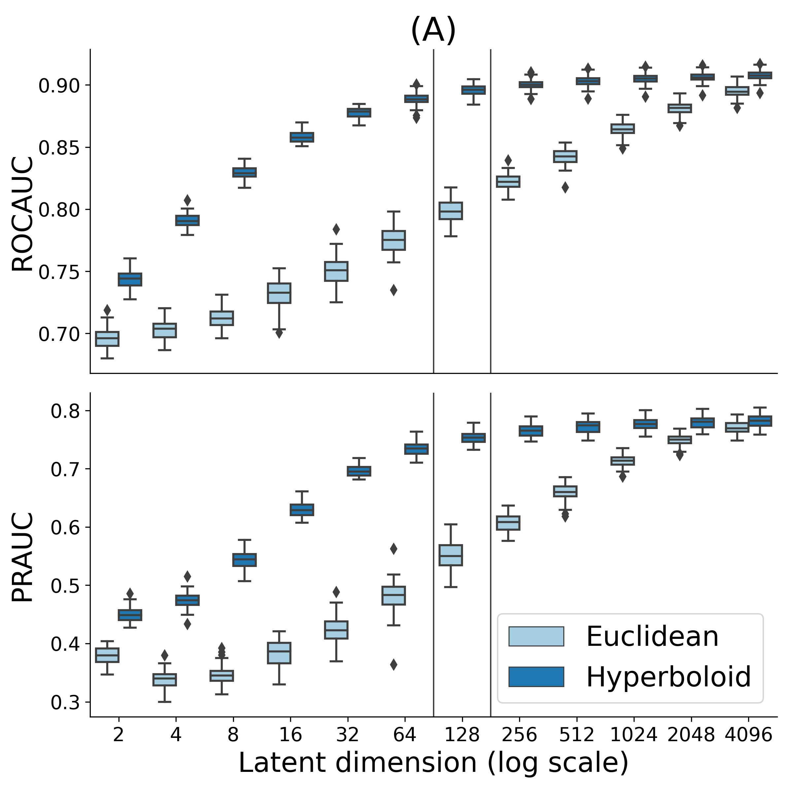
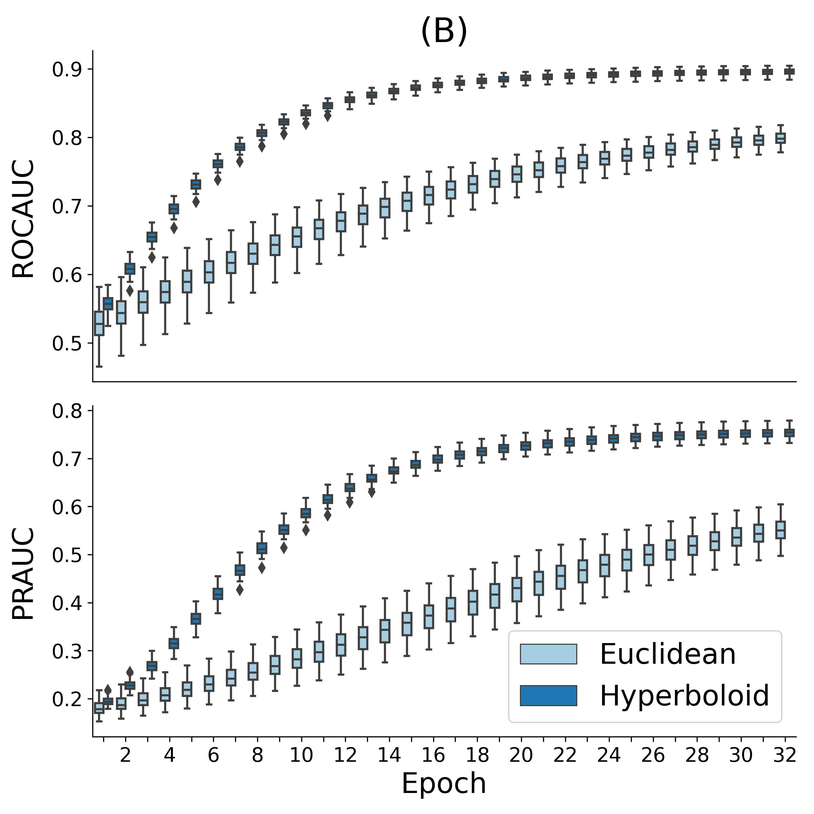
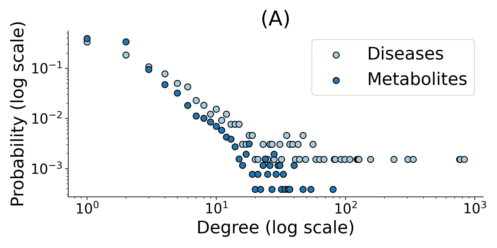
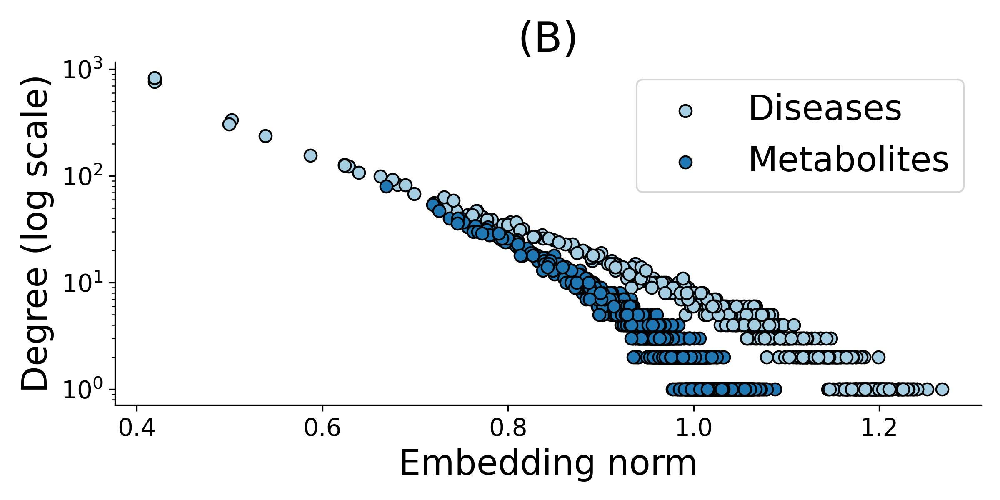
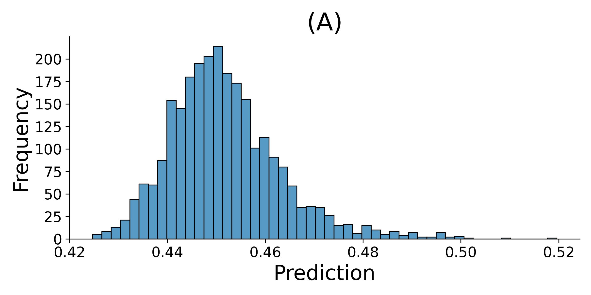
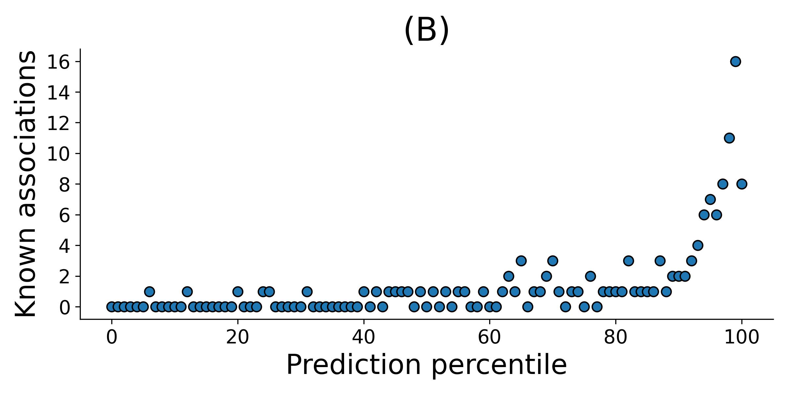

# Hyperbolic Metabolite-Disease Association Prediction

Pytorch implementation of a hyperbolic matrix-factorization model to the paper "[Hyperbolic Metabolite-Disease Association Prediction](https://www.esann.org/sites/default/files/proceedings/2024/ES2024-29.pdf)"

[ESANN conference poster](ESANN_hyperbolic_MDA_prediction_poster.pdf) 

Contact Information: pogany@mit.bme.hu

## Data availability

For the paper, we have utilized the latest version of the Human Metabolome Database (HMDB 5.0), which is freely available through the [HMDB webpage](https://hmdb.ca/).

## Requirements

To run the notebooks, we utilized Python 3.9.7 and the following packages:
- `lxml` (version 4.6.3)
- `pandas` (version 1.3.4)
- `numpy` (version 1.22.4)
- `scipy` (version 1.12.0)
- `scikit-learn` (version 1.4.1)
- `torch` (version 1.12.1)
- `geoopt` (version 0.5.0)
- `matplotlib` (version 3.6.3)
- `seaborn` (version 0.11.2)

## Contents

- `utils.py`: Data and model-related classes and functions.
- `Preprocessing.ipynb`: Extract the HMDB associations.
- `Cross_validation.ipynb`: Perform a repeated cross-validation, save, and visualize the results.
- `Experiments.ipynb`: Fit and use a model.

## How to reproduce the paper

1. First, download the "All Metabolites" XML file from the [HMDB webpage](https://hmdb.ca/downloads) and unzip it into the `data` folder as `hmdb_metabolites.xml`.

2. Then, run the [preprocessing notebook](Preprocessing.ipynb) to produce the association matrix.

3. Perform the repeated cross-validation with the [cross-validation notebook](Cross_validation.ipynb), save the results corresponding to a given configuration, and visualize them in *Figure 1.*
<div style="text-align:center">

<p>Cross-validation results, with box plots summarizing the outcomes across the five folds and ten repeats. (A) ROCAUC and PRAUC scores reached in the final epoch for models with various latent manifolds and dimensions. (B) Lateral view of a slice from A, corresponding to models with 128 latent dimensions, showcasing training curves for a Euclidean and a hyperbolic model.</p>
</div>

4. Finally, use the [experiments notebook](Experiments.ipynb) to investigate the hyperbolic embeddings and the model's predictions, reproducing *Figure 2.* and *Figure 3.*
<div style="text-align:center">

<p>Relationship between degree distribution and hyperbolic embedding norms. (A) Degree distribution of different modalities in the bipartite association graph. (B) Node degrees plotted against their corresponding embedding norms given by a model employing a 256-dimensional hyperboloid manifold.</p>

<p>Model outputs for Alzheimer's disease based on distances in the 256-dimensional hyperboloid manifold. (A) Histogram of predictions given to each metabolite. (B) Observed association frequencies for each prediction percentile.</p>
</div>

## How to predict new associations

After downloading and processing the HMDB database, with the [experiments notebook](Experiments.ipynb), one can fit a model on this data, predict associations for an arbitrary disease, and list the top N candidate metabolites.

## Citation   
```
@inproceedings{pogany2024hyperbolic,
  title={Hyperbolic Metabolite-Disease Association Prediction},
  author={Pog{\'a}ny, Domonkos and Antal, P{\'e}ter},
  booktitle={Proceedings of the 32nd European Symposium on Artificial Neural Networks, Computational Intelligence and Machine Learning (ESANN 2024)},
  pages={333--338},
  year={2024},
  doi={10.14428/esann/2024.ES2024-29}
}
``` 
